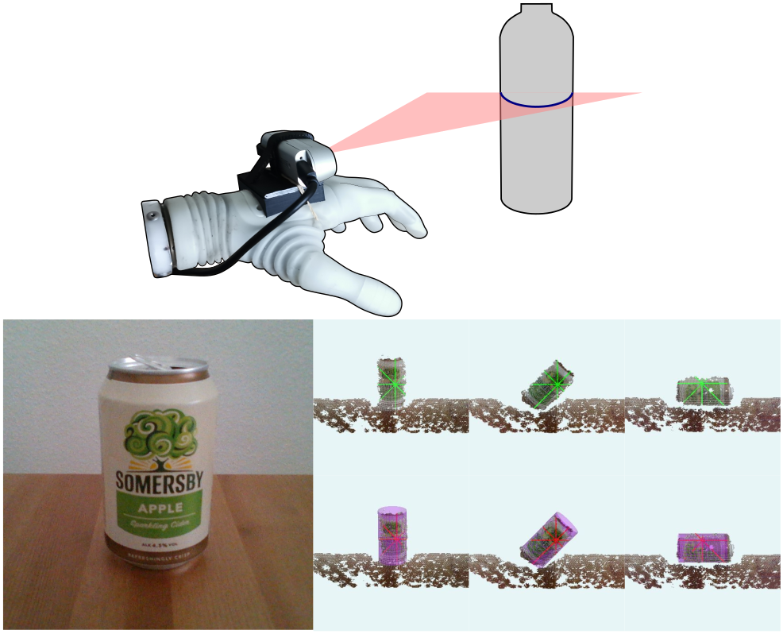

# Semi-auto Prosthesis Control Using Computer Vision

## Robin C++ framework

ROBIN Project: Depth cameras for Ottobock's Michelangelo prosthetic hand

The following code presents the implementation of the "Direct Least Square Fitting of Ellipses" (Fitzgibbon *et al*., 1999) manuscript and the calculation of the minimal distance from a set of arbitrary points to the fitted ellipse.

## Dependencies
* [PointCloudLibrary 1.12.1](https://github.com/PointCloudLibrary/pcl)* ([PCL#5430](https://github.com/PointCloudLibrary/pcl/pull/5430), [PCL#5431](https://github.com/PointCloudLibrary/pcl/issues/5431))\
* [OpenCV 4.5.5](https://github.com/opencv/opencv)\
* [TensorFlow Lite C++ API](https://github.com/tensorflow/tensorflow) ([build w/ Bazel](https://youtube.com/watch?v=1IhMISYvZG0))\
* [GoogleTest](https://github.com/google/googletest)\
* [Intel® RealSense™ SDK 2.0 (v2.48.0)](https://github.com/IntelRealSense/librealsense)\
* [Royale SDK](https://pmdtec.com/en/)\
* [Engineering Acoustics Inc TDK](https://www.eaiinfo.com/product/int-tactor-development-kit/)

## Supported Hardware
Prostheses:
* Ottobock's Michelangelo hand via Bluetooth UDP-connection

Cameras:
* Intel® RealSense™ d400 series (Active Stereoscopy, RGBD)
* PMD Technologies's PicoFlexx (Time-of-Flight, D-only)
* Remote IP RGBD camera via OpenCV

Myoelectric interfaces:
* Ottobock's 13E200=60 Electrodes via Michelangelo hand

Sensory Feedback interfaces:
* Engineering Acoustics Inc's C2 vibrotactors

## List of Publications
[1] Castro MN and Dosen S (2022). Semi-autonomous Prosthesis Control Using Minimal Depth Information and Vibrotactile Feedback. *IEEE Transactions on Human-Machine Systems* (under review). [arXiv:2210.00541](https://arxiv.org/abs/2210.00541).\
[2] Castro MN and Dosen S (2022). Continuous Semi-autonomous Prosthesis Control Using a Depth Sensor on the Hand. *Frontiers in Neurorobotics*, 16:814973. DOI: [10.3389/fnbot.2022.814973](https://doi.org/10.3389/fnbot.2022.814973).

## Acknowledgements
This work done at the Department of Health Science and Technology, Aalborg University, was supported by the Independent Research Fund Denmark through the project ROBIN "RObust Bidirectional human-machine INterface for natural control and feedback in hand prostheses" (8022-00243A).